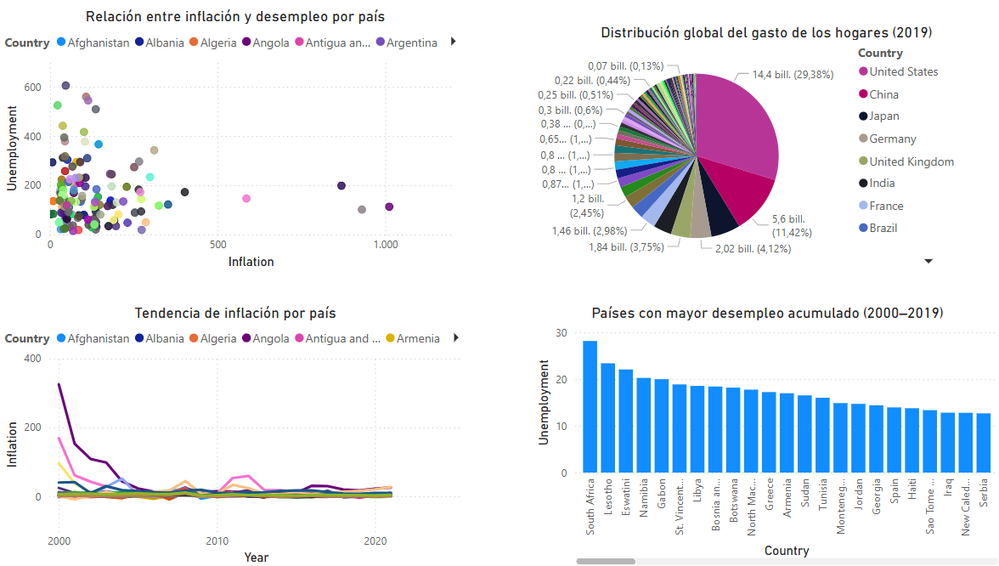

# Proyecto Final de ETL — Stream de Indicadores Económicos
##### Este proyecto tiene como objetivo construir un pipeline completo de ETL que integre diversas herramientas del ecosistema moderno de datos. El flujo incluye la extracción de indicadores económicos desde una base de datos y una API pública, su transformación y modelado dimensional, almacenamiento en PostgreSQL, transmisión en tiempo real mediante Apache Kafka, validación con Great Expectations, orquestación con Airflow y visualización en tiempo real con Streamlit. El resultado final es una solución automatizada y escalable para el análisis económico global.

## Componentes del Proyecto

#### 1. Orquestación del pipeline
- Se utiliza Apache Airflow para orquestar todo el proceso ETL de forma automatizada.

- Cada fase (extracción, transformación, carga, validación y streaming) está representada como una tarea dentro del DAG ETL_economy_pipeline.

- Airflow garantiza la ejecución ordenada, repetible y monitoreable de todo el flujo.

#### 2. Extracción de Datos
Se utiliza la API del Banco Mundial para obtener datos económicos clave como la tasa de desempleo, para todos los países desde el año 2000 hasta 2023.

#### 3. Transformación
- Limpieza y normalización de los datos obtenidos.

- Selección y modelado dimensional de los indicadores clave.

- Uso de pandas para procesamiento intermedio.

#### 4. Carga
- Carga de datos históricos a una base de datos PostgreSQL.

- Datos de referencia como premios Grammy también se cargan como parte del entorno analítico.

#### 5. Transmisión de Datos en Tiempo Real
- Kafka es utilizado para simular un flujo en tiempo real de datos de desempleo.

- Se publica un mensaje por país al tópico unemployment_topic.

#### 6. Visualización Interactiva
- Streamlit se emplea para construir una interfaz que escucha el stream de Kafka y actualiza dinámicamente un gráfico de barras con la tasa de desempleo por país.

- El gráfico inicia con un país y va acumulando nuevas entradas conforme llegan.

## Dashboard


## Tecnologías Utilizadas
- Python 3

- Airflow

- Kafka (Apache Kafka + Kafka-Python)

- PostgreSQL

- Pandas

- Streamlit

- Requests (para consumo de API)

- SQLAlchemy

- Docker (opcional para levantar el ecosistema)

## Cómo ejecutar el proyecto

#### 1. Clona el repositorio
````
git clone https://github.com/dcontreras1/ETL_final_project
cd ETL_final_project
````

#### 2. Instala las dependencias
`pip install -r requirements.txt`

#### 3. Levanta Kafka y Zookeeper
`docker-compose up -d`

#### 4. Ejecuta Airflow y lanza el DAG
````
export AIRFLOW_HOME=$(pwd)
airflow standalone
````

#### 5. Ejecuta el consumidor con Streamlit
`streamlit run dags/Scripts/Consumer_kafka.py`